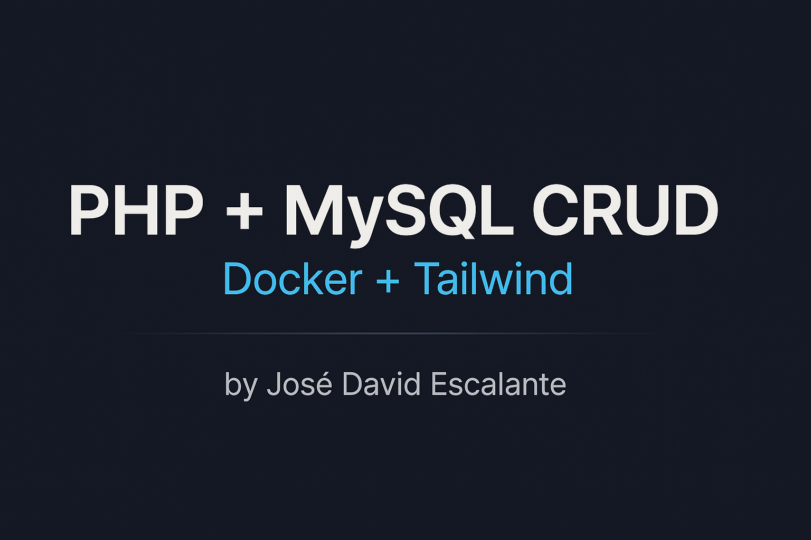
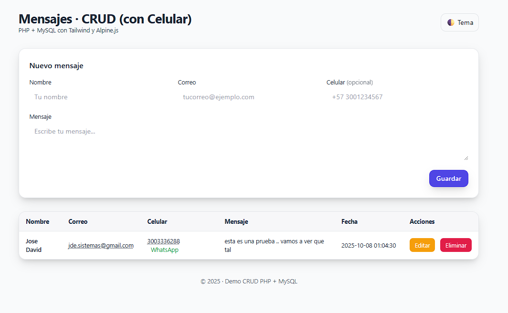
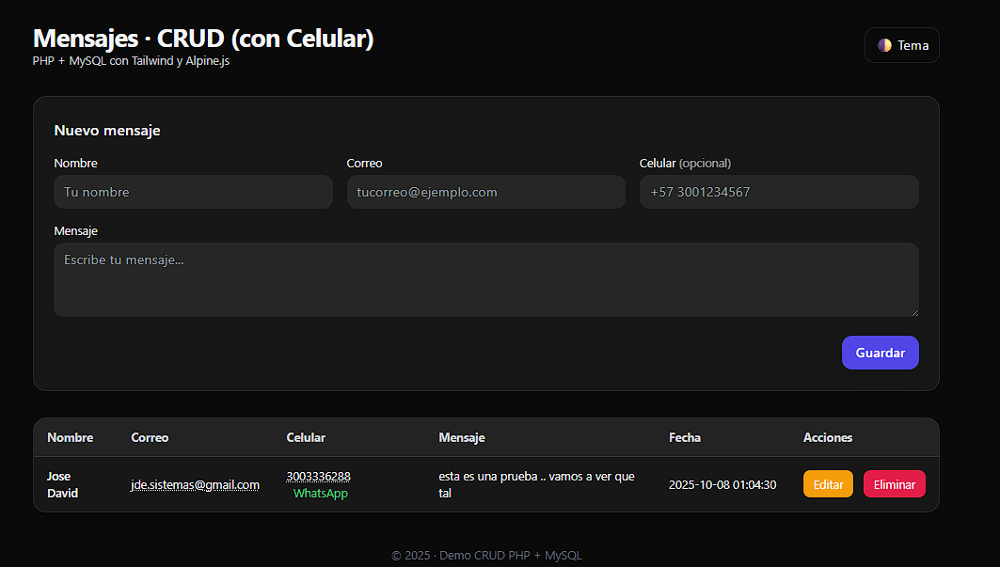
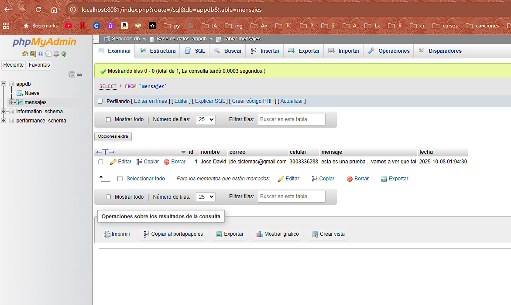

<p align="center">
  
</p>

<h1 align="center">🚀 PHP + MySQL CRUD con Docker & phpMyAdmin</h1>

<p align="center">
Aplicación web moderna desarrollada en <b>PHP 8.3 + MySQL 8.0</b> con despliegue automatizado mediante <b>Docker Compose</b>.<br>
Incluye módulo CRUD completo, migraciones automáticas y panel de administración con <b>phpMyAdmin</b>.
</p>

---

## 🧰 Stack Tecnológico

| Componente | Versión / Imagen | Descripción |
|-------------|------------------|--------------|
| **PHP** | `php:8.3-apache` | Aplicación principal con PDO y mod_rewrite habilitados |
| **MySQL** | `mysql:8.0` | Base de datos relacional persistente |
| **phpMyAdmin** | `phpmyadmin:latest` | Interfaz web para administrar MySQL |
| **TailwindCSS** | CDN | Estilos modernos, responsivos y ligeros |
| **Alpine.js** | CDN | Interactividad para formularios y modales |

---

## 📁 Estructura del Proyecto

```bash
curso-docker-web-php/
│
├── app/
│   ├── Dockerfile
│   ├── index.php
│   ├── db.php
│   └── ...
│
├── initdb/
│   └── 000_schema.sql
│
├── migrations/
│   ├── 000_schema.sql
│   └── 001_add_celular.sql
│
├── screenshots/
│   ├── banner.png
│   ├── app-light.png
│   ├── app-dark.png
│   └── phpmyadmin.png
│
├── .env
└── docker-compose.yml
```

---

## ⚙️ Configuración del entorno

Archivo `.env`:

```bash
MYSQL_ROOT_PASSWORD=rootpass
MYSQL_DATABASE=app
MYSQL_USER=app
MYSQL_PASSWORD=app
TZ=America/Bogota
```

---

## 🐳 Despliegue con Docker

```bash
docker compose up -d --build
```

### 🔗 Servicios disponibles
| Servicio | URL | Descripción |
|-----------|-----|-------------|
| 🌐 App PHP | http://localhost:8080 | Aplicación CRUD principal |
| 🧰 phpMyAdmin | http://localhost:8081 | Interfaz de administración MySQL |

**Credenciales phpMyAdmin:**
- Servidor: `db`
- Usuario: `app`
- Contraseña: `app`

---

## 🖼️ Capturas de Pantalla

### 💡 Interfaz principal (modo claro)
<p align="center">
  
</p>

### 🌙 Modo oscuro
<p align="center">
  
</p>

### 🧰 Panel phpMyAdmin
<p align="center">
  
</p>

---

<p align="center">
  <b>Desarrollado por José David Escalante</b><br>
  💻 <i>Administrador de Infraestructura & Desarrollador Fullstack</i>
</p>
